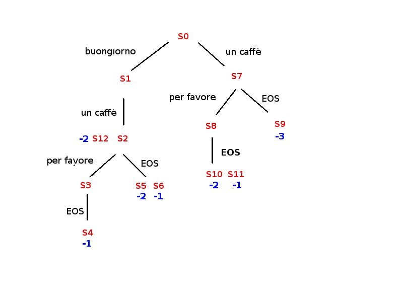
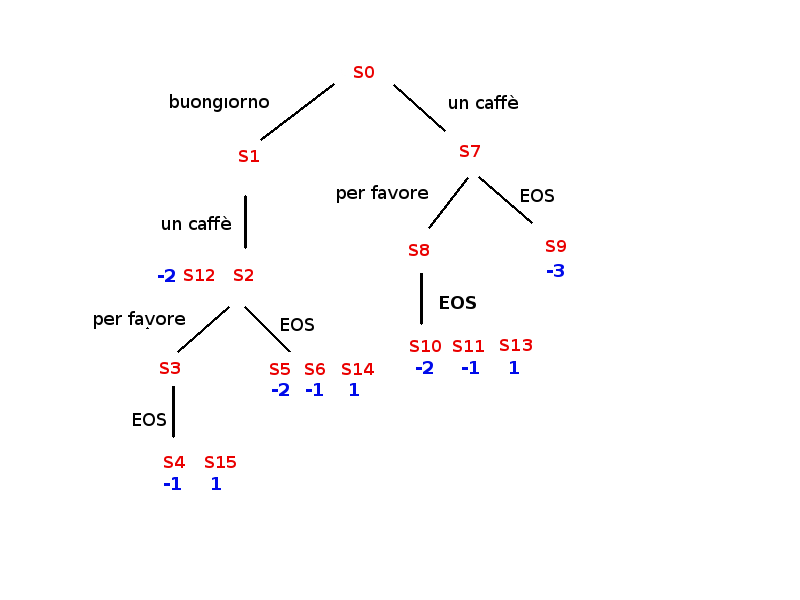

# Introduction to Machine Learning for Natural Language Processing
### Introduction
For the analysis part of the report, we are selecting the practical Introduction to
Reinforcement Learning, which includes Q-learning algorithm implementation in Python.
The goal is to learn the optimal policy for a dialogue system. The dialogue system is
represented as a set of states that the agent can transition between based on the actions it
takes, which are represented as words. The agent starts in the state 0, and based on the
word it selects, it may transition to a new state with a certain probability and receive a
certain reward. The agent's goal is to maximize the total reward it receives. The Q-matrix
is initialized with 0s and is updated during the training process using the Q-learning
update rule. The agent explores the environment by randomly selecting an action from
the set of possible actions at each state, and exploits the knowledge it has gained by
choosing the action with the highest Q-value. The agent's performance is evaluated by the
total rewards it receives during each episode.

In this project, we aimed to design an RL agent that learns some obvious politeness rules
in an Italian café. The café has a sign above the counter that displays the prices of a
coffee based on the politeness of the customer's request: "un caffè" costs 3 EUR,
"buongiorno, un caffè" costs 2 EUR, and "buongiorno, un caffè per favore" costs 1 EUR.
The goal of the agent is to learn the optimal sequence of actions that results in the lowest
cost for a coffee.

### Data and Model
To implement this RL problem, we would need to define the environment, including the
states, actions, and rewards as described earlier, initialize the agent with a policy, such as
an epsilon-greedy strategy, which balances exploration and exploitation, implement the
value function, such as using Q-learning, to update the agent's knowledge of the expected
rewards for different actions in different states, run the algorithm for a set number of episodes or until the agent reaches a satisfactory level of performance and finally, update the policy as the agent learns more about the environment.

The environment for this problem was defined as a set of states, actions, and rewards.
The states represent the different phases of the customer's request, the actions represent
the different phrases the customer can say, and the rewards represent the cost of the
coffee. The environment for this RL problem can be defined as follows:

**Cases:** 

Case 1: The café owner is in a good mood 
Case 2: The café owner is busy 

**States:** 

The states in this problem represent the various stages of the interaction between the
agent (customer) and the café owner. There are 16 states in total. The states represent the
following:

State 0: The initial state where the customer can say "buongiorno" or "un caffè" 
State 1: The customer says "un caffè" 
State 2: The customer says "per favore" or "EOS" 
State 3: The customer says "EOS" 
State 4-6: The customer is charged 1-3 EUR for the coffee 
State 7: The customer says "un caffè per favore" 
State 8: The customer says "per favore" or "EOS" 
State 9-11: The customer is charged 1-3 EUR for the coffee 
State 12: The customer is charged 2 EUR for the coffee 
State 13-15: The customer is given a free coffee with a big smile 

**Figure 01: States diagram for actions and rewards without free coffee**

**Figure 02: States diagram for actions and rewards with free coffee**

**Actions:** 

Action 1: Say "Buongiorno, un caffè per favore" (most polite) 
Action 2: Say "Buongiorno, un caffè" (polite) 
Action 3: Say "Un caffè, per favore" (not very polite) 
Action 4: Say "Un caffè" (impolite) 

**Rewards:** 

**In Case 1:** 
Action 1a: 1 for 0 EUR (most polite, café owner is in a good mood, offers free coffee) 
Action 1b: -1 for 1 EUR (most polite, café owner is in a good mood) 
Action 2a: 1 for 0 EUR (polite, café owner is in a good mood, offers free coffee) 
Action 2b: -1 for 1 EUR (polite, café owner is in a good mood) 
Action 3a: 1 for 0 EUR (not very polite, café owner is in a good mood, offers free coffee) 
Action 3b: -1 for 1 EUR (not very polite, café owner is in a good mood) 
Action 4: -3 for 3 EUR (impolite, café owner is in a good mood) 

**In Case 2:** 
Action 1: -2 for 2 EUR (most polite, café owner is busy) 
Action 2: -3 for 3 EUR (polite, café owner is busy) 
Action 3: -2 for 2 EUR (not very polite, café owner is busy) 
Action 4: -3 for 3 EUR (impolite, café owner is busy) 

The agent's goal is to learn the Q-values for each state-action pair, which represent the
expected future reward for taking a specific action in a specific state.

### Run the code

`python3 caffe_with_evaluation.py`
